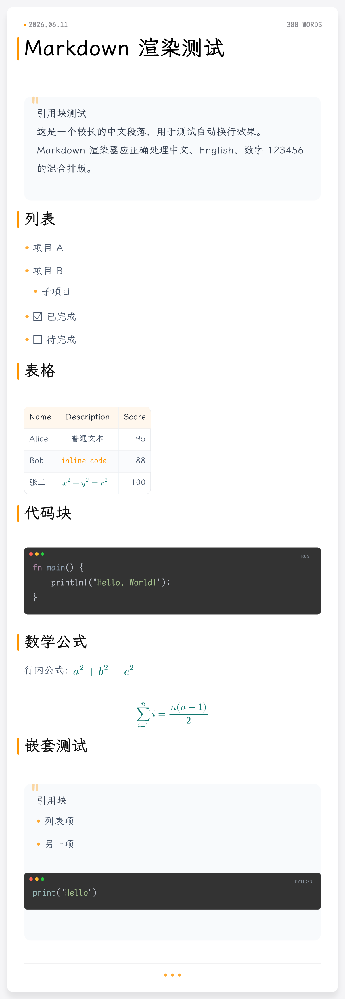

# Markdown Preview Service

一个基于 Rust + Axum 的 Markdown 转 PNG 图片服务。

服务接收 Markdown 原文，渲染成带卡片样式的 PNG 图片返回。当前样式是浅灰背景、白色圆角卡片、橙色点缀、深色代码块，并保留代码语法高亮、表格、引用块和数学公式渲染。正文、标题、列表、引用和表格文本使用 `cosmic-text` 做字体度量与自动换行，数学公式由 MathJax 渲染为 SVG 后合成到最终 PNG。

## 效果预览




## 功能特性

- Markdown 转 PNG
- 支持中文内容
- 支持标题、段落、列表、引用块、分割线、表格
- 支持任务列表
- 支持代码块语法高亮
- 代码块会先进行语法高亮，再按可用宽度自动换行
- 支持行内数学公式和块级数学公式
- 长行内公式会按可换行片段拆分，换行后保持同一公式字号，不做整体缩小
- 支持中英文混排文本自动换行
- 使用 `cosmic-text` 进行正文、标题、列表、引用和表格的字体度量排版
- 块级元素使用类似 CSS margin collapse 的间距折叠逻辑，标题、正文、代码块、公式块、表格、引用块和分割线的外部留白保持统一
- 标题和正文使用明确的“块顶部 -> 文本基线”布局模型，避免大字号标题向上侵入前一个块
- 内置 `LXGW WenKai` 与 `LXGW WenKai Mono` 字体，打包后的程序无需依赖系统预装字体

## 字体说明

服务已经通过 `include_bytes!` 将项目内字体打包进程序：

```text
sources/fonts/LXGWWenKai-Regular.ttf
sources/fonts/LXGWWenKai-Medium.ttf
sources/fonts/LXGWWenKaiMono-Medium.ttf
```

这些字体会同时用于：

- `cosmic-text` 文本度量与自动换行
- `usvg/resvg` SVG 文本解析与 PNG 栅格化
- 正文、标题、列表、引用、表格和代码块渲染

因此正常运行 release exe 或 Docker 镜像时，不需要手动安装字体，也不需要刷新系统字体缓存。

当前 SVG 字体栈仍保留系统字体作为兜底：

```css
'LXGW WenKai', 'Microsoft YaHei', 'SimHei', 'Noto Sans CJK SC', sans-serif
```

只有在你要用外部工具直接预览 SVG，或者调试系统字体回退时，才需要把字体安装到操作系统。

## 快速开始

### 方式一：直接运行 release exe

如果已经编译好了，可以直接运行：

```powershell
D:\GitHub\markdownPreviewService\target\release\markdown-preview-service.exe
```

或者在项目目录中运行：

```powershell
.\target\release\markdown-preview-service.exe
```

启动成功后会看到类似输出：

```text
Server listening on 0.0.0.0:3001
```

浏览器访问：

```text
http://localhost:3001/
```

如果看到下面内容，说明服务已启动：

```text
Markdown-to-PNG Service is running
```

### 方式二：使用 Docker 运行

拉取镜像：

```bash
docker pull radiant303/markdown-preview-service:latest
```

启动服务：

```bash
docker run -d \
  --name markdown-preview-service \
  -p 3001:3001 \
  --restart unless-stopped \
  radiant303/markdown-preview-service:latest
```

如果需要固定版本，可以使用：

```bash
docker pull radiant303/markdown-preview-service:0.0.7
docker run -d --name markdown-preview-service -p 3001:3001 --restart unless-stopped radiant303/markdown-preview-service:0.0.7
```

启动后访问：

```text
http://localhost:3001/
```

生成 PNG：

```bash
curl -X POST --data-binary "@test.md" http://localhost:3001/generate -o output.png
```

停止服务：

```bash
docker stop markdown-preview-service
```

删除容器：

```bash
docker rm markdown-preview-service
```

### 方式三：使用 Cargo 运行

```powershell
cargo run
```

### 方式四：重新编译 release 版本

修改代码后，需要重新编译 release exe：

```powershell
cargo build --release
```

然后再运行：

```powershell
.\target\release\markdown-preview-service.exe
```

## 修改端口

默认端口是 `3001`。

可以通过环境变量 `PORT` 修改端口。

PowerShell 示例：

```powershell
$env:PORT=8080
.\target\release\markdown-preview-service.exe
```

然后访问：

```text
http://localhost:8080/
```

## API 说明

### 健康检查

```http
GET /
```

响应：

```text
Markdown-to-PNG Service is running
```

### 生成 PNG

```http
POST /generate
```

请求体直接传 Markdown 原文，不是 JSON。

推荐请求头：

```http
Content-Type: text/plain; charset=utf-8
```

响应内容：

```http
Content-Type: image/png
```

## Apifox 调用方式

1. 启动服务

   ```powershell
   .\target\release\markdown-preview-service.exe
   ```

2. 在 Apifox 新建请求

   - Method：`POST`
   - URL：`http://localhost:3001/generate`

3. 设置 Headers

   | Key | Value |
   | --- | --- |
   | `Content-Type` | `text/plain; charset=utf-8` |

4. 设置 Body

   Body 选择 `raw`，类型选择 `Text`，然后填写 Markdown：

   ````markdown
   # 测试标题

   这是一段 Markdown 内容。

   ## 列表

   - 第一项
   - 第二项
   - 第三项

   ## 代码

   ```rust
   fn main() {
       println!("hello");
   }
   ```
   ````

5. 点击发送

   响应是 PNG 图片二进制。Apifox 中可以切换到预览，或者下载响应保存为 `.png` 文件。

## curl 示例

使用项目中的 `test.md` 生成图片：

```powershell
curl.exe -X POST --data-binary "@test.md" http://localhost:3001/generate -o output.png
```

PowerShell 原生命令：

```powershell
Invoke-WebRequest `
  -Uri http://localhost:3001/generate `
  -Method POST `
  -InFile test.md `
  -OutFile output.png
```

生成结果：

```text
output.png
```

## Markdown 示例

````markdown
# 示例文档

这是一段中文 Markdown 内容。长中文段落会自动换行。

## 功能列表

- 支持标题
- 支持列表
- 支持代码块
- [x] 支持任务列表
- [ ] 待办事项

> 这是一个引用块。引用中的中文、英文和行内代码也会参与统一排版。

---

## 表格示例

| 功能 | 状态 |
| --- | --- |
| 中文换行 | 已支持 |
| 代码高亮 | 已支持 |
| 数学公式 | 已支持 |

## 代码示例

```python
def greet(name: str) -> str:
    return f"Hello, {name}!"
```

## 数学公式

行内公式：$E = mc^2$

块级公式：

$$
\frac{a}{\sin A} = \frac{b}{\sin B} = \frac{c}{\sin C} = 2R
$$
````

## 样式说明

当前代码已经按职责拆分，主要文件如下：

```text
src/main.rs         HTTP 服务入口与 Markdown -> SVG -> PNG 流程
src/constants.rs    画布尺寸、字号、行高、主题颜色
src/svg_builder.rs  SVG 卡片布局与各类 Markdown 块渲染
src/text.rs         文本 run、字体度量、自动换行
src/code.rs         代码高亮与代码行折行
src/math.rs         MathJax SVG 渲染与公式尺寸计算
src/ast.rs          pulldown-cmark 事件到内部 AST 的转换
```

相关位置：

- 布局尺寸：`IMAGE_WIDTH`、`PADDING`、`BODY_FONT_SIZE`、`LINE_HEIGHT`
- 主题颜色：`COLOR_SURFACE`、`COLOR_CARD`、`COLOR_TEXT`、`COLOR_SEED`
- 统一块间距：`BLOCK_GAP`、`apply_block_top_gap`、`set_block_bottom_gap`
- 标题样式：`add_heading`
- 正文样式：`add_paragraph`
- 代码块样式：`add_code_block`
- 数学公式块：`add_math_block`
- 表格样式：`add_table`
- 引用块样式：`render_quote`
- 字体栈：`build` 中的 SVG `<style>` 与 `src/globals.rs` 中的字体加载

当前正文字体优先级：

```css
'LXGW WenKai', 'Microsoft YaHei', 'SimHei', 'Noto Sans CJK SC', sans-serif
```

代码块字体优先级：

```css
'LXGW WenKai Mono', monospace
```

## 注意事项

- `/generate` 接收的是 Markdown 原文，不是 JSON。
- 如果 Apifox 里看到乱码，通常是因为响应是 PNG 二进制，需要用图片预览或下载查看。
- 修改代码后，如果你运行的是 `target/release/markdown-preview-service.exe`，需要重新执行 `cargo build --release`。
- 当前渲染是手写 SVG 排版，不是浏览器排版引擎，因此复杂 Markdown/CSS 效果不会与浏览器完全一致。
- 输出 PNG 的清晰度主要受 `IMAGE_WIDTH`、SVG 视口尺寸、字体文件质量和 `resvg/tiny-skia` 栅格化结果影响；当前默认宽度为 `1200px`。
- 块间距采用折叠模型：上一个块的 bottom gap 与下一个块的 top gap 取较大值，而不是相加。
